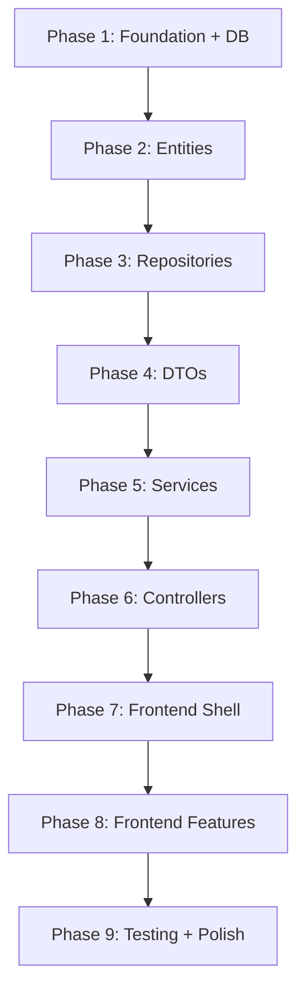

# RideFair — Implementation Plan

## Target Directory Structure

```
RideFair/
├── pom.xml
├── research.md
├── plan.md
├── src/
│   ├── main/
│   │   ├── java/com/jk/miniproject/RideFair/
│   │   │   ├── RideFairApplication.java
│   │   │   ├── config/
│   │   │   │   └── WebConfig.java
│   │   │   ├── entity/
│   │   │   │   ├── User.java
│   │   │   │   ├── FriendGroup.java
│   │   │   │   ├── Bike.java
│   │   │   │   ├── Ride.java
│   │   │   │   ├── ExpenseType.java
│   │   │   │   ├── Expense.java
│   │   │   │   ├── ExpenseShare.java
│   │   │   │   └── Transaction.java
│   │   │   ├── repository/
│   │   │   │   ├── UserRepository.java
│   │   │   │   ├── FriendGroupRepository.java
│   │   │   │   ├── BikeRepository.java
│   │   │   │   ├── RideRepository.java
│   │   │   │   ├── ExpenseRepository.java
│   │   │   │   ├── ExpenseShareRepository.java
│   │   │   │   └── TransactionRepository.java
│   │   │   ├── dto/
│   │   │   │   ├── request/
│   │   │   │   │   ├── CreateUserRequest.java
│   │   │   │   │   ├── CreateGroupRequest.java
│   │   │   │   │   ├── AddMemberRequest.java
│   │   │   │   │   ├── CreateBikeRequest.java
│   │   │   │   │   ├── LogRideRequest.java
│   │   │   │   │   ├── CreateExpenseRequest.java
│   │   │   │   │   └── SettleUpRequest.java
│   │   │   │   └── response/
│   │   │   │       ├── UserResponse.java
│   │   │   │       ├── GroupResponse.java
│   │   │   │       ├── BikeResponse.java
│   │   │   │       ├── RideResponse.java
│   │   │   │       ├── ExpenseResponse.java
│   │   │   │       ├── BalanceResponse.java
│   │   │   │       ├── SimplifiedDebtResponse.java
│   │   │   │       └── TransactionResponse.java
│   │   │   ├── service/
│   │   │   │   ├── UserService.java
│   │   │   │   ├── GroupService.java
│   │   │   │   ├── BikeService.java
│   │   │   │   ├── RideService.java
│   │   │   │   ├── ExpenseService.java
│   │   │   │   ├── BalanceService.java
│   │   │   │   └── TransactionService.java
│   │   │   └── controller/
│   │   │       ├── UserController.java
│   │   │       ├── GroupController.java
│   │   │       ├── BikeController.java
│   │   │       ├── RideController.java
│   │   │       ├── ExpenseController.java
│   │   │       ├── BalanceController.java
│   │   │       └── TransactionController.java
│   │   └── resources/
│   │       ├── application.properties
│   │       └── static/
│   │           ├── index.html
│   │           ├── css/
│   │           │   └── style.css
│   │           └── js/
│   │               ├── api.js
│   │               ├── app.js
│   │               ├── pages/
│   │               │   ├── dashboard.js
│   │               │   ├── groups.js
│   │               │   ├── bikes.js
│   │               │   ├── rides.js
│   │               │   ├── expenses.js
│   │               │   ├── balances.js
│   │               │   └── settle.js
│   │               └── components/
│   │                   ├── navbar.js
│   │                   ├── modal.js
│   │                   └── toast.js
│   └── test/
│       └── java/com/jk/miniproject/RideFair/
│           ├── RideFairApplicationTests.java
│           └── service/
│               ├── RideServiceTest.java
│               └── BalanceServiceTest.java
```

---

## Phase 1: Project Foundation & Database Setup

**Goal:** Get the application running with H2 database connectivity.

### Tasks

| # | File | Action |
|---|------|--------|
| 1.1 | `pom.xml` | Add H2 runtime dependency |
| 1.2 | `src/main/resources/application.properties` | Configure H2 file-mode datasource, JPA settings, H2 console |

### Configuration Details

**application.properties:**
```properties
spring.application.name=RideFair

# H2 Database (file mode for persistence across restarts)
spring.datasource.url=jdbc:h2:file:./data/ridefair
spring.datasource.driver-class-name=org.h2.Driver
spring.datasource.username=sa
spring.datasource.password=

# JPA / Hibernate
spring.jpa.hibernate.ddl-auto=update
spring.jpa.show-sql=true
spring.jpa.properties.hibernate.format_sql=true

# H2 Console (accessible at /h2-console)
spring.h2.console.enabled=true
spring.h2.console.path=/h2-console
```

### Verification
- Application starts without errors.
- H2 console is accessible at `http://localhost:8080/h2-console`.

---

## Phase 2: JPA Entities

**Goal:** Define all database tables via JPA entity classes.

### Tasks

| # | File | Key Details |
|---|------|-------------|
| 2.1 | `entity/User.java` | id, name, email (unique), phone, createdAt |
| 2.2 | `entity/FriendGroup.java` | id, name, createdAt, ManyToMany with User via `group_members` |
| 2.3 | `entity/Bike.java` | id, name, fuelEfficiency, ManyToOne owner → User |
| 2.4 | `entity/Ride.java` | id, distance, fuelFilled, petrolPrice, dateTime, ManyToOne bike, ManyToOne fuelFilledBy (nullable), ManyToMany borrowers via `ride_borrowers` |
| 2.5 | `entity/ExpenseType.java` | Enum: RIDE_USAGE, RIDE_FUEL, MANUAL |
| 2.6 | `entity/Expense.java` | id, description, totalAmount, type, date, ManyToOne paidBy, ManyToOne group, ManyToOne ride (nullable) |
| 2.7 | `entity/ExpenseShare.java` | id, shareAmount, ManyToOne expense, ManyToOne user |
| 2.8 | `entity/Transaction.java` | id, amount, note, date, ManyToOne fromUser, ManyToOne toUser |

### Build Order
Entities must be created in FK-dependency order: User → FriendGroup → Bike → Ride → ExpenseType → Expense → ExpenseShare → Transaction.

### Verification
- Application starts, check H2 console — all tables created with correct columns and foreign keys.

---

## Phase 3: Repositories

**Goal:** Create Spring Data JPA repository interfaces for data access.

### Tasks

| # | File | Custom Methods |
|---|------|---------------|
| 3.1 | `repository/UserRepository.java` | `findByEmail(String email)` |
| 3.2 | `repository/FriendGroupRepository.java` | `findByMembersContaining(User user)` |
| 3.3 | `repository/BikeRepository.java` | `findByOwner(User owner)` |
| 3.4 | `repository/RideRepository.java` | `findByBike(Bike bike)`, `findByBorrowersContaining(User user)` |
| 3.5 | `repository/ExpenseRepository.java` | `findByGroup(FriendGroup group)`, `findByRide(Ride ride)` |
| 3.6 | `repository/ExpenseShareRepository.java` | `findByExpenseIn(List<Expense> expenses)`, `findByUser(User user)` |
| 3.7 | `repository/TransactionRepository.java` | `findByFromUserOrToUser(User from, User to)` |

### Verification
- Application starts without errors. No need for manual testing yet — repositories are tested via services.

---

## Phase 4: DTOs

**Goal:** Create request/response objects to decouple API layer from entities.

### Request DTOs

| # | File | Fields |
|---|------|--------|
| 4.1 | `dto/request/CreateUserRequest.java` | name, email, phone |
| 4.2 | `dto/request/CreateGroupRequest.java` | name, memberIds (List<Long>) |
| 4.3 | `dto/request/AddMemberRequest.java` | userId |
| 4.4 | `dto/request/CreateBikeRequest.java` | name, fuelEfficiency, ownerId |
| 4.5 | `dto/request/LogRideRequest.java` | bikeId, borrowerIds, distance, fuelFilled, fuelFilledById (nullable), petrolPrice |
| 4.6 | `dto/request/CreateExpenseRequest.java` | description, totalAmount, paidById, splitAmongIds, groupId |
| 4.7 | `dto/request/SettleUpRequest.java` | fromUserId, toUserId, amount, note |

### Response DTOs

| # | File | Fields |
|---|------|--------|
| 4.8 | `dto/response/UserResponse.java` | id, name, email, phone |
| 4.9 | `dto/response/GroupResponse.java` | id, name, members (List<UserResponse>) |
| 4.10 | `dto/response/BikeResponse.java` | id, name, fuelEfficiency, owner (UserResponse) |
| 4.11 | `dto/response/RideResponse.java` | id, bikeName, ownerName, borrowers, distance, fuelFilled, fuelFilledByName, petrolPrice, rideCost, dateTime |
| 4.12 | `dto/response/ExpenseResponse.java` | id, description, totalAmount, type, paidByName, shares, date |
| 4.13 | `dto/response/BalanceResponse.java` | fromUser (UserResponse), toUser (UserResponse), amount |
| 4.14 | `dto/response/SimplifiedDebtResponse.java` | fromUser (UserResponse), toUser (UserResponse), amount |
| 4.15 | `dto/response/TransactionResponse.java` | id, fromUser, toUser, amount, note, date |

---

## Phase 5: Services (Core Business Logic)

**Goal:** Implement all computation and data access logic.

### Tasks

| # | File | Key Methods |
|---|------|------------|
| 5.1 | `service/UserService.java` | createUser(), getAllUsers(), getUserById() |
| 5.2 | `service/GroupService.java` | createGroup(), addMember(), removeMember(), getAllGroups(), getGroupById() |
| 5.3 | `service/BikeService.java` | createBike(), getAllBikes(), getBikesByOwner() |
| 5.4 | `service/RideService.java` | logRide() — saves ride + auto-generates 1-2 expenses, getRidesByBike(), getRidesByUser() |
| 5.5 | `service/ExpenseService.java` | createManualExpense(), getExpensesByGroup() |
| 5.6 | `service/BalanceService.java` | getPairwiseBalances(), getSimplifiedDebts(), getUserBalance() |
| 5.7 | `service/TransactionService.java` | settleUp(), getTransactionsByUser() |

### Critical Logic in RideService.logRide()

```
1. Fetch bike → get owner and fuelEfficiency
2. Save Ride entity
3. rideCost = (distance / fuelEfficiency) * petrolPrice
4. Create Expense (type=RIDE_USAGE, amount=rideCost, paidBy=owner)
5. For each borrower: create ExpenseShare (amount = rideCost / N)
6. If fuelFilled > 0:
   a. Create Expense (type=RIDE_FUEL, amount=fuelFilled, paidBy=filler)
   b. For each borrower: create ExpenseShare (amount = fuelFilled / N)
7. Return RideResponse with cost breakdown
```

### Critical Logic in BalanceService.getSimplifiedDebts()

```
1. Compute net balance per user (total owed to them - total they owe)
2. Separate into creditors (positive) and debtors (negative)
3. Sort both by absolute amount descending
4. While debtors and creditors remain:
   a. Take largest debtor and largest creditor
   b. Transfer min(|debtor_balance|, |creditor_balance|)
   c. Reduce both balances
   d. Remove any that reach zero
5. Return list of SimplifiedDebtResponse
```

---

## Phase 6: REST Controllers

**Goal:** Expose all business logic via clean REST endpoints.

### Tasks

| # | File | Endpoints |
|---|------|-----------|
| 6.0 | `config/WebConfig.java` | CORS configuration |
| 6.1 | `controller/UserController.java` | POST /api/users, GET /api/users, GET /api/users/{id} |
| 6.2 | `controller/GroupController.java` | POST /api/groups, GET /api/groups, GET /api/groups/{id}, POST /api/groups/{id}/members, DELETE /api/groups/{id}/members/{userId} |
| 6.3 | `controller/BikeController.java` | POST /api/bikes, GET /api/bikes, GET /api/bikes/owner/{userId} |
| 6.4 | `controller/RideController.java` | POST /api/rides, GET /api/rides, GET /api/rides/bike/{bikeId}, GET /api/rides/user/{userId} |
| 6.5 | `controller/ExpenseController.java` | POST /api/expenses, GET /api/expenses/group/{groupId} |
| 6.6 | `controller/BalanceController.java` | GET /api/balances/group/{groupId}, GET /api/balances/group/{groupId}/simplified, GET /api/balances/user/{userId}/group/{groupId} |
| 6.7 | `controller/TransactionController.java` | POST /api/transactions, GET /api/transactions/user/{userId} |

---

## Phase 7: Frontend Shell

**Goal:** Build the HTML/CSS structure and JavaScript SPA infrastructure.

### Tasks

| # | File | Purpose |
|---|------|---------|
| 7.1 | `static/index.html` | Single-page shell with nav bar and content container |
| 7.2 | `static/css/style.css` | Modern card-based responsive design |
| 7.3 | `static/js/api.js` | Centralized fetch() wrapper for all API calls |
| 7.4 | `static/js/app.js` | Hash-based router (#/dashboard, #/rides, etc.) |
| 7.5 | `static/js/components/navbar.js` | Tab navigation component |
| 7.6 | `static/js/components/modal.js` | Reusable modal for forms |
| 7.7 | `static/js/components/toast.js` | Success/error notification component |

---

## Phase 8: Frontend Features

**Goal:** Wire up all pages to the backend API.

### Tasks

| # | File | Features |
|---|------|----------|
| 8.1 | `static/js/pages/dashboard.js` | Summary cards (owe/owed/rides), quick actions, recent rides |
| 8.2 | `static/js/pages/groups.js` | Create group form, member management, group list |
| 8.3 | `static/js/pages/bikes.js` | Register bike form, bike card grid |
| 8.4 | `static/js/pages/rides.js` | Log ride form with live cost preview, ride history table |
| 8.5 | `static/js/pages/expenses.js` | Manual expense form, expense history list |
| 8.6 | `static/js/pages/balances.js` | Pairwise balance matrix, simplified debts, per-user summary |
| 8.7 | `static/js/pages/settle.js` | Settle up form, payment history table |

---

## Phase 9: Testing & Polish

**Goal:** Ensure correctness and improve UX.

### Tasks

| # | File | Purpose |
|---|------|---------|
| 9.1 | `test/.../service/RideServiceTest.java` | Test expense generation for all ride scenarios |
| 9.2 | `test/.../service/BalanceServiceTest.java` | Test balance computation and debt simplification |
| 9.3 | Frontend polish | Form validation, error handling, loading states, empty states, responsive tweaks |

---

## Phase Dependency Flow


