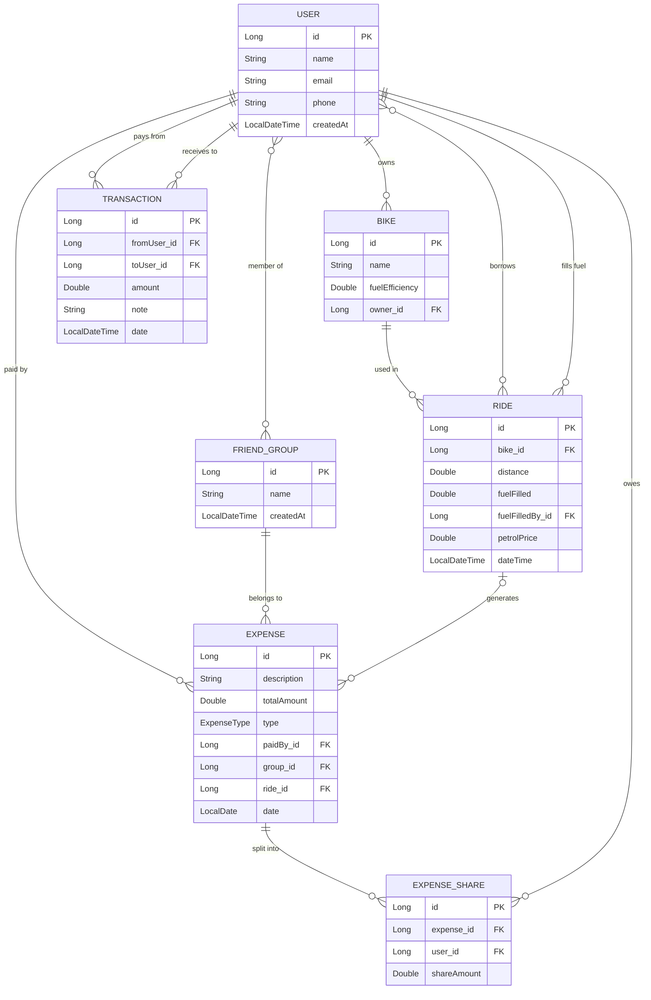
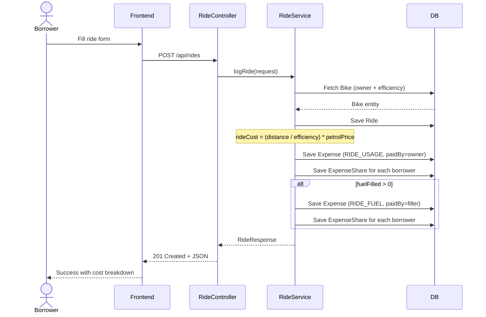
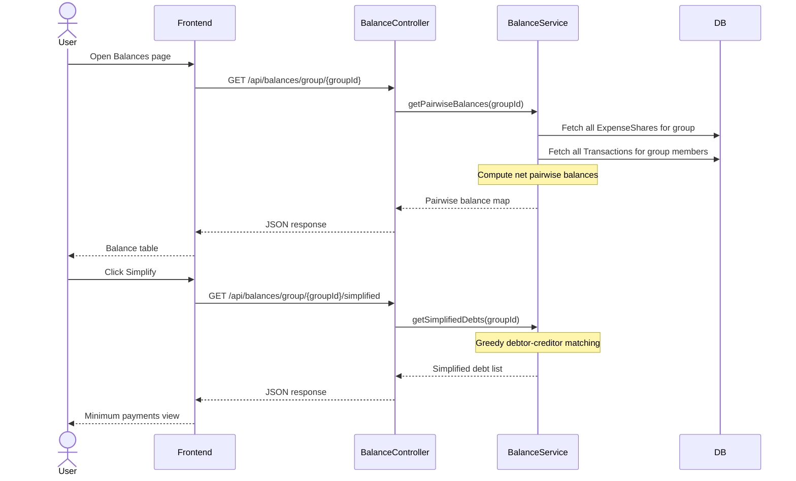
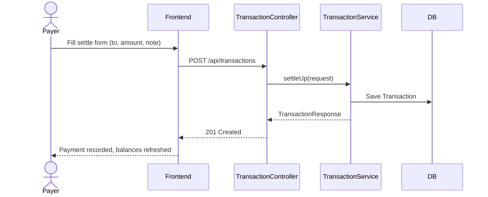
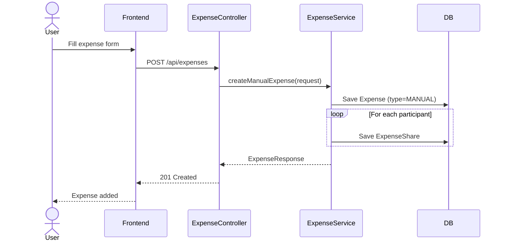

# RideFair — Project Research & Specification

## 1. Problem Statement

A group of friends shares a limited number of bikes. Only some friends own bikes, while others frequently borrow them. When a non-owner borrows a bike:

- They consume the owner's fuel.
- Sometimes they fill petrol (possibly more than they consumed), sometimes they don't.
- There is no easy way to track who owes whom, especially when multiple people borrow the same bike over time, or when multiple people share a single ride.

**RideFair** solves this by automatically calculating the fair cost of each ride based on distance and fuel efficiency, comparing it to what the borrower actually paid at the pump, and maintaining a running ledger of debts — like Splitwise, but purpose-built for shared bikes.

---

## 2. Core Concepts

### 2.1 Ride Cost Formula

Every ride has a calculable fuel cost based on physics:

```
rideCost = (distance / fuelEfficiency) × petrolPrice
```

Where:
- `distance` = kilometers traveled
- `fuelEfficiency` = bike's rated km per litre
- `petrolPrice` = current price of petrol in ₹ per litre

### 2.2 Single-Borrower Settlement

```
settlement = rideCost - fuelFilled

If settlement > 0 → borrower owes the bike owner (consumed more than paid)
If settlement < 0 → owner owes the borrower (borrower overfilled)
If settlement = 0 → perfectly settled
```

### 2.3 Multi-Borrower Ride Splitting

When N borrowers share a ride, the ride is decomposed into two independent Splitwise-style expenses:

**Expense 1 — Bike Usage Cost:**
- Amount: `rideCost`
- Paid by: bike owner (their fuel was consumed)
- Split among: all N borrowers equally
- Each borrower's share: `rideCost / N`

**Expense 2 — Fuel Fill (only if someone filled petrol):**
- Amount: `fuelFilled` (₹)
- Paid by: the borrower who filled
- Split among: all N borrowers equally
- Each non-filler borrower's share: `fuelFilled / N`

This decomposition cleanly handles all cases — no fill, partial fill, overfill, single borrower, multiple borrowers.

### 2.4 Splitwise-Style Settlement Engine

Underneath the ride-specific logic, RideFair maintains a generic expense ledger:

- Every expense (auto-generated from rides or manually created) produces `ExpenseShare` records.
- Every settlement payment produces a `Transaction` record.
- The system computes **pairwise net balances** by summing all shares and transactions.
- A **debt simplification algorithm** minimizes the number of payments needed to settle the group.

**Debt Simplification Algorithm:**
1. For each user, compute `netBalance = (total they are owed) - (total they owe)`.
2. Separate users into creditors (positive balance) and debtors (negative balance).
3. Sort both lists by absolute amount, descending.
4. Match the largest debtor with the largest creditor: transfer `min(|debtor|, |creditor|)`.
5. Remove anyone who reaches zero. Repeat until all balances are zero.

This produces the minimum number of transactions to fully settle the group.

---

## 3. Example Scenarios

### Scenario A: Single borrower, no fuel fill

- **Bike:** Karthik's Pulsar (40 km/l)
- **Borrower:** Ravi
- **Distance:** 20 km
- **Petrol price:** ₹100/l
- **Fuel filled:** ₹0

```
rideCost = (20 / 40) × 100 = ₹50
settlement = 50 - 0 = ₹50
→ Ravi owes Karthik ₹50
```

### Scenario B: Single borrower, overfill

- **Bike:** Karthik's Pulsar (40 km/l)
- **Borrower:** Ravi
- **Distance:** 10 km
- **Petrol price:** ₹100/l
- **Fuel filled:** ₹100

```
rideCost = (10 / 40) × 100 = ₹25
settlement = 25 - 100 = -₹75
→ Karthik owes Ravi ₹75
```

### Scenario C: Multiple borrowers, one fills fuel

- **Bike:** Karthik's Pulsar (40 km/l)
- **Borrowers:** Ravi, Deepak, Suresh (3 people)
- **Distance:** 30 km
- **Petrol price:** ₹100/l
- **Fuel filled:** ₹150 by Ravi

**Expense 1 — Bike usage:**
```
rideCost = (30 / 40) × 100 = ₹75
Paid by: Karthik (owner)
Split 3 ways: each borrower owes Karthik ₹25
Ledger: Ravi→Karthik +25, Deepak→Karthik +25, Suresh→Karthik +25
```

**Expense 2 — Fuel fill:**
```
Amount: ₹150
Paid by: Ravi
Split 3 ways: each share = ₹50
Deepak owes Ravi ₹50, Suresh owes Ravi ₹50
Ledger: Deepak→Ravi +50, Suresh→Ravi +50
```

**Net result:**
| From | To | Amount |
|------|----|--------|
| Ravi | Karthik | ₹25 |
| Deepak | Karthik | ₹25 |
| Deepak | Ravi | ₹50 |
| Suresh | Karthik | ₹25 |
| Suresh | Ravi | ₹50 |

### Scenario D: Debt simplification

After many rides, the group has:
- A owes B ₹100
- B owes C ₹100

Simplified: A pays C ₹100 directly. B is removed from the chain. Only 1 payment instead of 2.

---

## 4. Entity Model

### 4.1 Entities

| Entity | Description |
|--------|-------------|
| **User** | A member of the friend group. Has name, email, phone. |
| **FriendGroup** | A named group of friends. Many-to-many with User. |
| **Bike** | A vehicle owned by one User. Has name, fuel efficiency (km/l). |
| **Ride** | A borrowing event. Links to a Bike, has one or more borrowers, distance, fuel info. |
| **Expense** | A debt-creating event. Can be auto-generated from a Ride or manually created. Types: RIDE_USAGE, RIDE_FUEL, MANUAL. |
| **ExpenseShare** | One user's share of an Expense. Links a User to an Expense with a specific amount. |
| **Transaction** | A real-world payment between two users to settle debts. |

### 4.2 Entity Fields

**User**
- `id` (Long, PK, auto-generated)
- `name` (String, required)
- `email` (String, unique)
- `phone` (String)
- `createdAt` (LocalDateTime)

**FriendGroup**
- `id` (Long, PK, auto-generated)
- `name` (String, required)
- `createdAt` (LocalDateTime)
- `members` (Set\<User\>, ManyToMany, join table: `group_members`)

**Bike**
- `id` (Long, PK, auto-generated)
- `name` (String, required — e.g., "Pulsar 150")
- `fuelEfficiency` (Double, required — km per litre)
- `owner` (User, ManyToOne)

**Ride**
- `id` (Long, PK, auto-generated)
- `bike` (Bike, ManyToOne)
- `borrowers` (Set\<User\>, ManyToMany, join table: `ride_borrowers`)
- `distance` (Double — km)
- `fuelFilled` (Double — ₹ amount, 0 if none)
- `fuelFilledBy` (User, ManyToOne, nullable)
- `petrolPrice` (Double — ₹ per litre)
- `dateTime` (LocalDateTime)

**ExpenseType** (Enum)
- `RIDE_USAGE` — auto-generated from a ride (bike owner's fuel consumed)
- `RIDE_FUEL` — auto-generated from a ride (borrower filled fuel)
- `MANUAL` — user-created expense (food, maintenance, etc.)

**Expense**
- `id` (Long, PK, auto-generated)
- `description` (String)
- `totalAmount` (Double)
- `type` (ExpenseType enum)
- `paidBy` (User, ManyToOne — the person who paid / is owed)
- `group` (FriendGroup, ManyToOne)
- `ride` (Ride, ManyToOne, nullable — only set for ride-generated expenses)
- `date` (LocalDate)

**ExpenseShare**
- `id` (Long, PK, auto-generated)
- `expense` (Expense, ManyToOne)
- `user` (User, ManyToOne — the person who owes this share)
- `shareAmount` (Double)

**Transaction**
- `id` (Long, PK, auto-generated)
- `fromUser` (User, ManyToOne — the person paying)
- `toUser` (User, ManyToOne — the person receiving)
- `amount` (Double)
- `note` (String)
- `date` (LocalDateTime)

### 4.3 ER Diagram



---

## 5. Sequence Diagrams

### 5.1 Log a Ride (Core Flow)



### 5.2 View Balances



### 5.3 Settle Up



### 5.4 Create Manual Expense



---

## 6. API Contract

### 6.1 Users

| Method | Endpoint | Description | Request Body | Response |
|--------|----------|-------------|-------------|----------|
| POST | `/api/users` | Create a user | `{ name, email, phone }` | UserResponse |
| GET | `/api/users` | List all users | — | List\<UserResponse\> |
| GET | `/api/users/{id}` | Get user by ID | — | UserResponse |

### 6.2 Groups

| Method | Endpoint | Description | Request Body | Response |
|--------|----------|-------------|-------------|----------|
| POST | `/api/groups` | Create a group | `{ name, memberIds }` | GroupResponse |
| GET | `/api/groups` | List all groups | — | List\<GroupResponse\> |
| GET | `/api/groups/{id}` | Get group by ID | — | GroupResponse |
| POST | `/api/groups/{id}/members` | Add member | `{ userId }` | GroupResponse |
| DELETE | `/api/groups/{id}/members/{userId}` | Remove member | — | GroupResponse |

### 6.3 Bikes

| Method | Endpoint | Description | Request Body | Response |
|--------|----------|-------------|-------------|----------|
| POST | `/api/bikes` | Register a bike | `{ name, fuelEfficiency, ownerId }` | BikeResponse |
| GET | `/api/bikes` | List all bikes | — | List\<BikeResponse\> |
| GET | `/api/bikes/owner/{userId}` | Bikes by owner | — | List\<BikeResponse\> |

### 6.4 Rides

| Method | Endpoint | Description | Request Body | Response |
|--------|----------|-------------|-------------|----------|
| POST | `/api/rides` | Log a ride | `{ bikeId, borrowerIds, distance, fuelFilled, fuelFilledById, petrolPrice }` | RideResponse |
| GET | `/api/rides` | List all rides | — | List\<RideResponse\> |
| GET | `/api/rides/bike/{bikeId}` | Rides for a bike | — | List\<RideResponse\> |
| GET | `/api/rides/user/{userId}` | Rides for a user | — | List\<RideResponse\> |

### 6.5 Expenses

| Method | Endpoint | Description | Request Body | Response |
|--------|----------|-------------|-------------|----------|
| POST | `/api/expenses` | Create manual expense | `{ description, totalAmount, paidById, splitAmongIds, groupId }` | ExpenseResponse |
| GET | `/api/expenses/group/{groupId}` | Expenses in a group | — | List\<ExpenseResponse\> |

### 6.6 Balances

| Method | Endpoint | Description | Response |
|--------|----------|-------------|----------|
| GET | `/api/balances/group/{groupId}` | Pairwise balances | List\<BalanceResponse\> |
| GET | `/api/balances/group/{groupId}/simplified` | Simplified debts | List\<SimplifiedDebtResponse\> |
| GET | `/api/balances/user/{userId}/group/{groupId}` | One user's net | BalanceResponse |

### 6.7 Transactions

| Method | Endpoint | Description | Request Body | Response |
|--------|----------|-------------|-------------|----------|
| POST | `/api/transactions` | Record settlement | `{ fromUserId, toUserId, amount, note }` | TransactionResponse |
| GET | `/api/transactions/user/{userId}` | Payment history | — | List\<TransactionResponse\> |

---

## 7. Tech Stack

| Layer | Technology |
|-------|-----------|
| Language | Java 21 |
| Framework | Spring Boot 4.0.5 |
| Web | Spring Web MVC |
| Persistence | Spring Data JPA + Hibernate |
| Database | H2 (file mode for persistence, switchable to PostgreSQL) |
| Utilities | Lombok |
| Frontend | Vanilla HTML, CSS, JavaScript (SPA with hash routing) |
| Build | Maven 3.9+ |

---

## 8. Future Enhancements (Post-MVP)

- **User authentication** — Spring Security with session-based or JWT auth
- **Fuel price auto-fetch** — pull current petrol prices by city via API
- **Ride verification** — owner confirms/approves a ride before it affects balances
- **Recurring rides** — templates for daily commute borrowing
- **Notifications** — reminders for pending dues
- **Group-level simplification** — multi-hop debt reduction across the entire group graph
- **PostgreSQL migration** — swap H2 for production-grade database
- **Mobile-responsive PWA** — installable on phones
